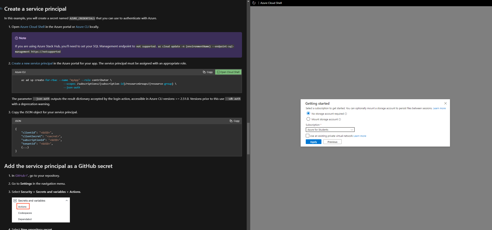
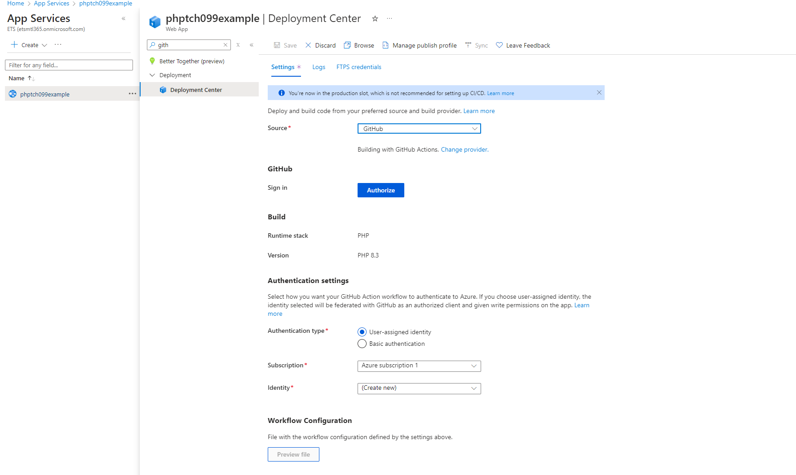

# Template for PHP Web Applications

## Features

- **API Endpoints:** Create custom API endpoints for your application.
- **User Authentication:** Implement user authentication with login, signup, and logout functionality.
- **Database Integration:** Use MySQL database for storing user data and other information.
- **Frontend Pages:** Create frontend pages with HTML, CSS, and JavaScript.
- **Docker Support:** Run the application locally using Docker Compose.

## Prerequisites

- Docker
- Docker Compose

## Project Structure

```
/

├── api/                        # Folder containing API endpoint scripts
│   ├── hello-world.php         # API endpoint for Hello World messages
│   ├── login.php               # API endpoint for user login
│   ├── logout.php              # API endpoint for user logout
│   ├── randomimage.php         # API endpoint to get a random image
│   ├── signup.php              # API endpoint for user signup
│   └── user_details.php        # API endpoint to fetch user details

├── db/                         # Folder containing SQL scripts for database setup
│   ├── contraines.sql          # SQL script for adding constraints
│   ├── create.sql              # SQL script for creating database tables
│   └── insert.sql              # SQL script for inserting initial data into database tables

├── frontend/                   # Folder containing frontend assets and pages
│   ├── css/                    # Folder containing CSS files
│   │   └── styles.css          # Main stylesheet for the frontend
│   ├── images/                 # Folder to store image assets
│   ├── js/                     # Folder containing JavaScript files
│   │   └── script.js           # Main JavaScript file for the frontend
│   └── pages/                  # Folder containing HTML pages
│       ├── hello-world.html    # HTML page for Hello World functionality
│       ├── index.html          # HTML page for the homepage
│       ├── login.html          # HTML page for the login form
│       ├── random-image.html   # HTML page to display a random image
│       └── signup.html         # HTML page for the signup form

├── config.php                  # Main configuration file for the project
├── router.php                  # Main router file for handling URL routing
├── routes.php                  # File defining the routes for the application
└── utils/                      # Folder containing utility scripts
    └── utils.php               # Utility functions for the application

├── vercel.json                 # Vercel configuration file for deployment
├── composer.json               # Composer configuration file for managing PHP dependencies
├── conf/                       # Folder containing configuration files
│   └── js-no-cache.conf        # Configuration file to disable JavaScript caching

├── docker-compose.yml          # Docker Compose configuration file for setting up the development environment
```

## Actors

- **User:** A user who interacts with the application by logging in, signing up, and accessing various features.
- **Admin:** A user with elevated privileges who can manage users and other aspects of the application.

## User Stories

- [X] **User Signup:** As a user, I want to create an account on the platform so that I can access the features.
- [X] **User Login:** As a user, I want to log in to my account so that I can access my profile and other features.
- [X] **User Logout:** As a user, I want to log out of my account to secure my session.
- [X] **View Hello World Message:** As a user, I want to see a "Hello World" message with my name.
- [X] **View Random Image:** As a user, I want to see a random image displayed on the page.
- [X] **View User Details:** As a user, I want to view my profile details such as username and email address.
- [] **Admin Login:** As an admin, I want to log in to my account to access admin features.

## Use Case


## Class Diagram


## Sequence Diagrams

### Login Process


### Hello World Process


### Check Admin Process


## API Endpoints

### User Authentication

#### Login

**Endpoint:** `/api/login.php`

**Method:** `POST`

**Request Body:**

```json
{
  "username": "example",
  "password": "password"
}
```

**Response:**

```json
{
  "status": "success",
  "message": "Login successful"
}
```

#### Signup

**Endpoint:** `/api/signup.php`

**Method:** `POST`

**Request Body:**

```json
{
  "username": "example",
  "password": "password",
  "email": "example@example.com",
  "role": "user"
}
```

**Response:**

```json
{
  "status": "success",
  "message": "Signup successful"
}
```

#### Logout

**Endpoint:** `/api/logout.php`

**Method:** `POST`

**Response:**

```json
{
  "status": "success",
  "message": "Logout successful"
}
```

#### User Details

**Endpoint:** `/api/user_details.php`

**Method:** `GET`

**Response:**

```json
{
  "status": "success",
  "data": {
    "username": "example",
    "email": "example@example.com",
    "role": "user"
  }
}
```

### Hello World

#### Get Greeting

**Endpoint:** `/api/hello-world/$langue`

**Method:** `GET` or `POST`

**Request Query Parameters:**

- `nom` (optional)
- `prenom` (optional)

**Response:**

```json
{
  "nom": "Doe",
  "prenom": "John",
  "langue": "en",
  "message": "Hello World John Doe!"
}
```

### Random Image

**Endpoint:** `/api/random-image`

**Method:** `GET`

**Response:**

A random image URL.

## Environment Variables

Create a `.env` file in your project root with the following content:

```
DB_HOST=your_database_host
MYSQL_DATABASE=your_database_name
MYSQL_USER=your_database_user
MYSQL_PASSWORD=your_database_password
```

Follow the prompts provided by Vercel CLI to complete the deployment.

## Docker Usage

To run the application locally using Docker:

```
docker-compose up -d --build
```

### Debugging

```
docker-compose ps
docker exec -it tch099-web-1
ls
```

https://learn.microsoft.com/en-us/azure/developer/github/connect-from-azure?tabs=azure-portal%2Cwindows&tryIt=true&source=docs#code-try-11
https://learn.microsoft.com/en-ca/entra/identity-platform/howto-create-service-principal-portal
https://portal.azure.com/#create/Microsoft.AppServiceWebAppDatabaseV3




